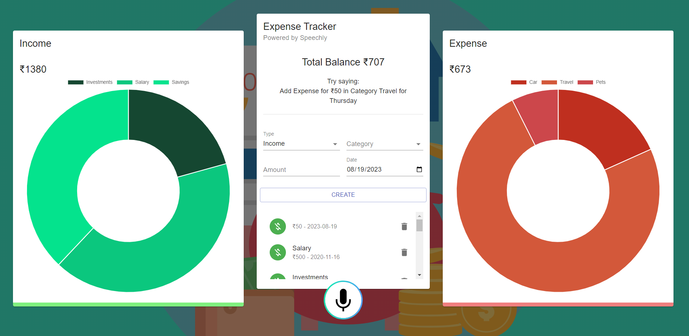

## Demo of the app

## Available Scripts

In the project directory, you can run:

### `### `npm start`
The npm install command is used to install the dependencies listed in your project's package.json file. It's a crucial step when setting up a Node.js project, as it ensures that all the required packages and libraries are downloaded and available for your project to run correctly.

### `npm start`

Runs the app in the development mode.\
Open [http://localhost:3000](http://localhost:3000) to view it in your browser.

The page will reload when you make changes.\
You may also see any lint errors in the console.

### `npm test`

Launches the test runner in the interactive watch mode.\

### `npm run build`

This process compiles the application for production and generates a `build` folder. It efficiently packages React in production mode, ensuring optimal performance. The build is both minified and includes hash-based filenames, enhancing readiness for deployment. Your application is now set for deployment.

